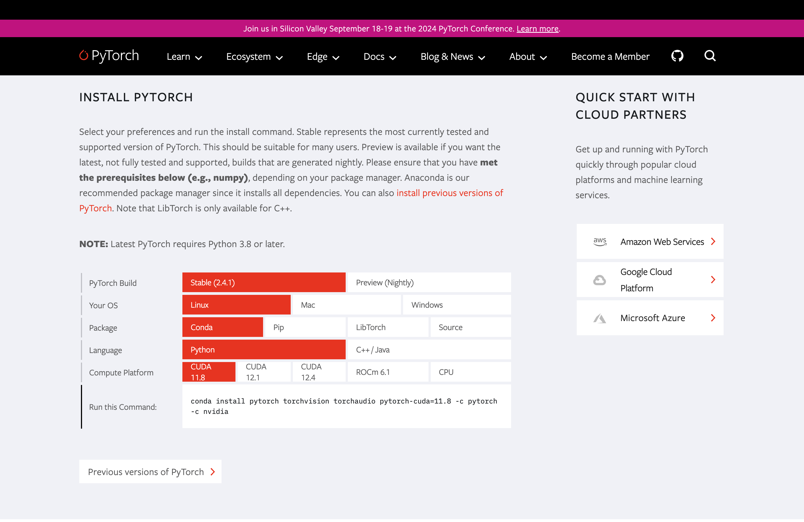

# 【実践】環境構築とGPU

## 実行環境

- Ubuntu22.04

- Anaconda24.5.0

## 概要

- **PyTorch**と**TensorFlow**の環境構築方法

- **GPU**の稼働チェック

## はじめに


この環境構築は全てAnacondaでの仮想環境を想定しているので、Anacondaがインストールされていない場合は先にインストールしておくこと

Anacondaに関しては`Bluehorse-hub/anaconda3-starterpack`を参照

## 注意

環境構築の際の注意点は`anaconda3-starterpack/トリセツ/環境構築詳細.pdf`を参照

## PyTorch


PyTorchは[公式サイト](https://pytorch.org/)を参照

公式サイトに移動したら下にスクロールし以下の場所まで行く



- `PyTorch Build`：デフォルトでOK

- `Your OS`：**Linux**を選択

- `Package`：**Conda**を選択

- `Language`：**Python**を選択

- `Compute Platform`：**CUDA**の中から選択

５つの項目を選択し`Run this Command:`のコマンドを実行する

例(CUDA11.8の場合)

```
conda install pytorch torchvision torchaudio pytorch-cuda=11.8 -c pytorch -c nvidia
```

## TensorFlow


### 1. TensorFlowの種類を確認

TensorFlowには大きく以下の3つのパターンがある

1. TensorFlow(GPUを使わない)

2. TensorFlow(GPUを使う)

3. TensorFlow-GPU

今回は**2**を説明する

### 2. TensorFlowのバージョン確認

GPUが使えるバージョンを入れる必要があるのでそれを確認する

```
conda search tensorflow
```

実行すると以下のように出力される

```
Loading channels: done
# Name                       Version           Build  Channel             
tensorflow                     1.4.1               0  pkgs/main           
tensorflow                     1.5.0               0  pkgs/main           
tensorflow                     1.6.0               0  pkgs/main           
tensorflow                     1.7.0               0  pkgs/main           
tensorflow                     1.8.0               0  pkgs/main           
...       
tensorflow                     1.9.0 eigen_py27hf386fcc_1  pkgs/main           
tensorflow                     1.9.0 eigen_py35h8c89287_1  pkgs/main           
tensorflow                     1.9.0 eigen_py36h8c89287_0  pkgs/main           
tensorflow                     1.9.0 eigen_py36hbec2359_0  pkgs/main           
tensorflow                     1.9.0 eigen_py36hbec2359_1  pkgs/main           
tensorflow                     1.9.0 eigen_py36hf386fcc_0  pkgs/main           
tensorflow                     1.9.0 gpu_py27h233f449_1  pkgs/main           
tensorflow                     1.9.0 gpu_py27h395d940_1  pkgs/main           
...    
```
この中の、`Build`欄が`gpu_xxx`になっている`Version`を選ぶ

### 3. 実際にインストールする

インストールするときは以下のコマンドで行う

```
conda install tensorflow=バージョン=gpu_*
```

例

```
conda install tensorflow=1.9.0=gpu_*
```

## GPU稼働チェック

### GPUとは

>GPUとは「Graphics Processing Unit」の略で、1999年に半導体メーカー「NVIDIA」が開発したもの。GPUはコンピューターの画像処理装置で、高速なグラフィック処理を得意とします  
[TECH CAMP](https://tech-camp.in/note/technology/43109/)より

元々はグラフィック処理をするものだが、その並列計算力が機械学習に用いられている

### GPUが認識されているか確認する

GPUはまずPCに認識されないと使用できない

`anaconda3-starterpack/gpuchecker`の環境に合ったものを使って確認できる

### 機械学習時にGPUが稼働しているか確認する

以下のコマンドで確認できる

```
watch nvidia-smi
```

実行すると以下のように出力される

```
Every 2.0s: nvidia-smi                                                                                                                  kiki-desktop: Sun Sep  8 15:46:13 2024

Sun Sep  8 15:46:13 2024
+-----------------------------------------------------------------------------------------+
| NVIDIA-SMI 555.58.02              Driver Version: 555.58.02      CUDA Version: 12.5     |
|-----------------------------------------+------------------------+----------------------+
| GPU  Name                 Persistence-M | Bus-Id          Disp.A | Volatile Uncorr. ECC |
| Fan  Temp   Perf          Pwr:Usage/Cap |           Memory-Usage | GPU-Util  Compute M. |
|                                         |                        |               MIG M. |
|=========================================+========================+======================|
|   0  NVIDIA GeForce GTX 1080        Off |   00000000:01:00.0 Off |                  N/A |
| 43%   34C    P8              8W /  220W |     169MiB /   8192MiB |      0%      Default |
|                                         |                        |                  N/A |
+-----------------------------------------+------------------------+----------------------+
|   1  NVIDIA GeForce GTX 1080        Off |   00000000:02:00.0  On |                  N/A |
| 43%   34C    P8              9W /  220W |     294MiB /   8192MiB |      0%      Default |
|                                         |                        |                  N/A |
+-----------------------------------------+------------------------+----------------------+

+-----------------------------------------------------------------------------------------+
| Processes:                                                                              |
|  GPU   GI   CI        PID   Type   Process name                              GPU Memory |
|        ID   ID                                                               Usage      |
|=========================================================================================|
|    0   N/A  N/A      1280      G   /usr/lib/xorg/Xorg                              4MiB |
|    0   N/A  N/A      1459    C+G   ...libexec/gnome-remote-desktop-daemon        158MiB |
|    1   N/A  N/A      1280      G   /usr/lib/xorg/Xorg                            162MiB |
|    1   N/A  N/A      1512      G   /usr/bin/gnome-shell                           29MiB |
|    1   N/A  N/A     10927      G   ...seed-version=20240827-180123.409000         93MiB |
|    1   N/A  N/A   3879186      G   gnome-control-center                            2MiB |
+-----------------------------------------------------------------------------------------+
```

右側にある%表記の箇所がGPUの使用率なので、ここの値が大きければGPUを用いて計算されていると言うこと

## 参考文献

- [AnacondaでGPU対応のTensorFlowをインストールする簡単な方法](https://qiita.com/yusuke_s_yusuke/items/dbe530ff7687603a81f6)

- [watch nvidia-smiでGPU使用率などを確認・リアルタイムモニタリング](https://note.nkmk.me/nvidia-smi-monitoring-gpu/)
